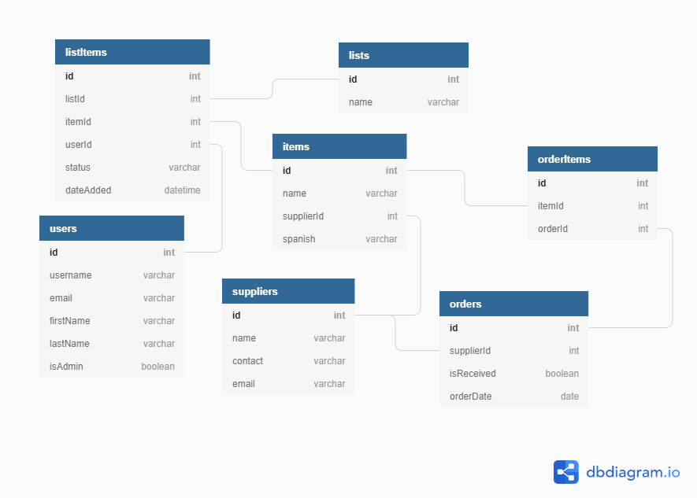

# Kitchen Companion
Kitchen Companion is an application to assist a restaurant kitchen with inventory management by creating a grocery list to which all members of the kitchen staff can add items. Admin users can manage suppliers and a database of orderable items. They can also log orders from the grocery list, which are then sorted by supplier and date and able to be marked 'received'. Other features include employee management and full CRUD functionality. The app was built using React.js and styled with Semantic UI and CSS, and all data is stored in a JSON database. 

## Table of Contents
  * [Features List](#features-list)
  * [Technologies Used](#technologies-used)
  * [Installing and Launching Domino](#instructions-for-installing-kitchen-companion)
  * [Planning Documentation](#planning-documentation)
    * [Entity Relationship Diagram](#entity-relationship-diagram)

## Features List

### Create, Update, and Delete Tasks

### Create, Update, and Delete Steps

### Connect Steps to Multiple Tasks

### Mark Tasks and Steps Complete

### Easily View Progress
  
### Update Color Settings

## Technologies Used
    React.js
    JavaScript
    HTML
    CSS
    Semantic UI React
    JSON

## Instructions for Installing Kitchen Companion


  Clone this repo on your personal machine using the following command in your terminal
  ```sh
    git clone git@github.com:kwohl/kitchen-companion.git
  ```

  Install the NPM dependencies for this project using the following commands
  ```sh
    cd kitchen-companion
    npm install
    npm install react-router-dom
    npm install semantic-ui-react
  ```
 
  After installing dependencies, go to your api directory to run your json database
  ```sh
    cd api
    touch database.json
    ls
  ```
  You should see a file called [database.json.example](https://github.com/kwohl/kitchen-companion/blob/master/api/database.json.example). Copy the contents of this file and paste them into your newly created database.json file.

  Next, run your JSON server by typing
  ```sh
    json-server -p 5002 database.json
  ```

  Finally, open a new terminal window, navigate to the main project directory, and type the following to start the app
  ```sh
    npm start
  ```

  Now that the server is up and running, you can open an internet browser and access the application
  ```sh
    http://localhost:8080/
  ```

## Planning Documentation

### Entity Relationship Diagram



This project was bootstrapped with [Create React App](https://github.com/facebook/create-react-app).